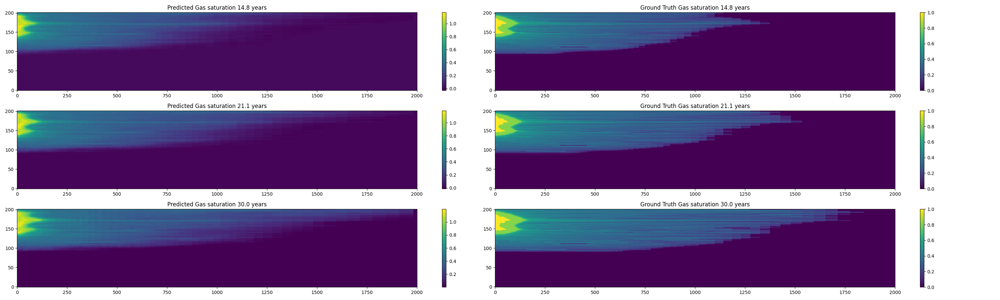
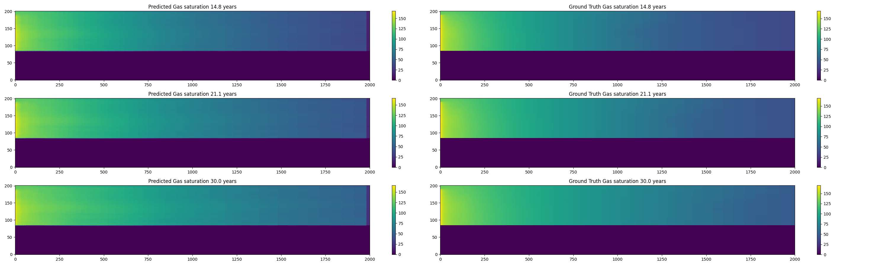

# CO2-U-Net

This projects trains a self-attention based U-Net to predict evolution of the pressure build up and gas saturation in a CO2 resevrvoir 30 years after injection using various geological fields, like permeability, porosity,temperature and the perforation interval.


### 1: Installation

1.1 Create a new virtual environment using the following command :
```
conda create -n {name of your environment} python=3.11
```

1.2 Activate your virtual environment:
```
conda activate {name of your new virtual environment}
```

1.3 Clone the git repository into your new virtual environment.
```
git clone https://github.com/gems-at223/CO2-U-Net.git
```
1.4 navigate to the repository

1.5 enter
```
pip install .
```


### Results for Gas Saturation

The image below shows the prediction for the last 3 time steps out of 24 for the gas saturation.


### Results for Pressure Buildup


The image below shows the prediction for the last 3 time steps out of 24 for the pressure buildup.


